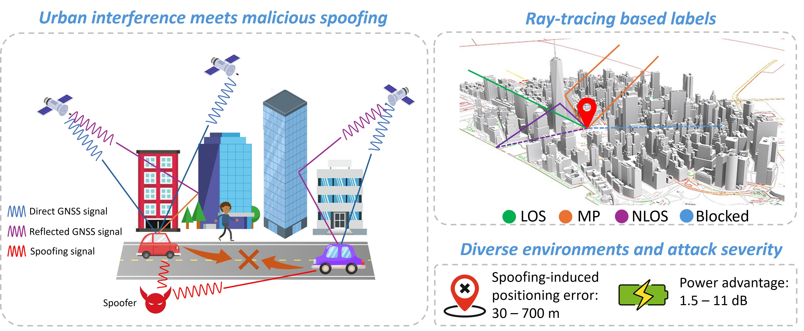
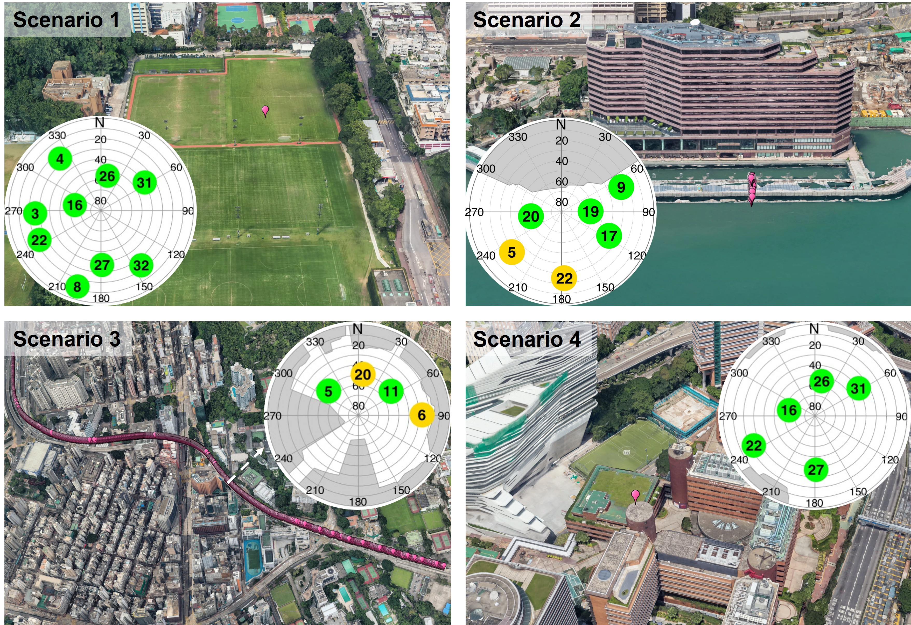
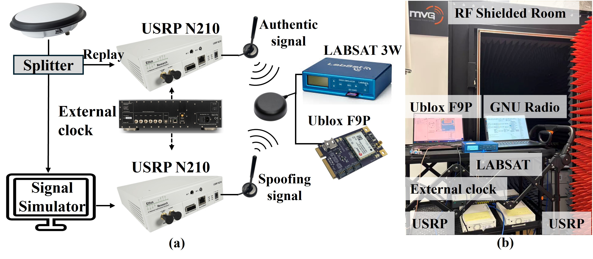
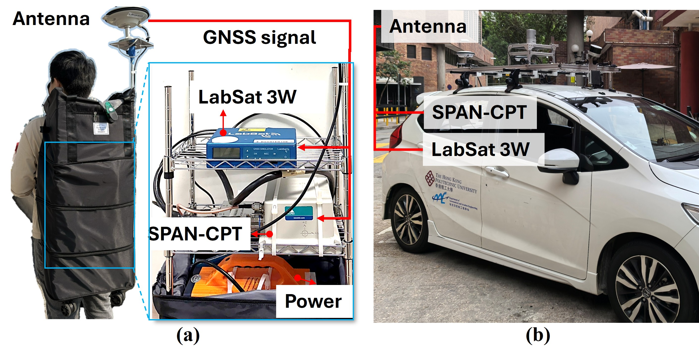
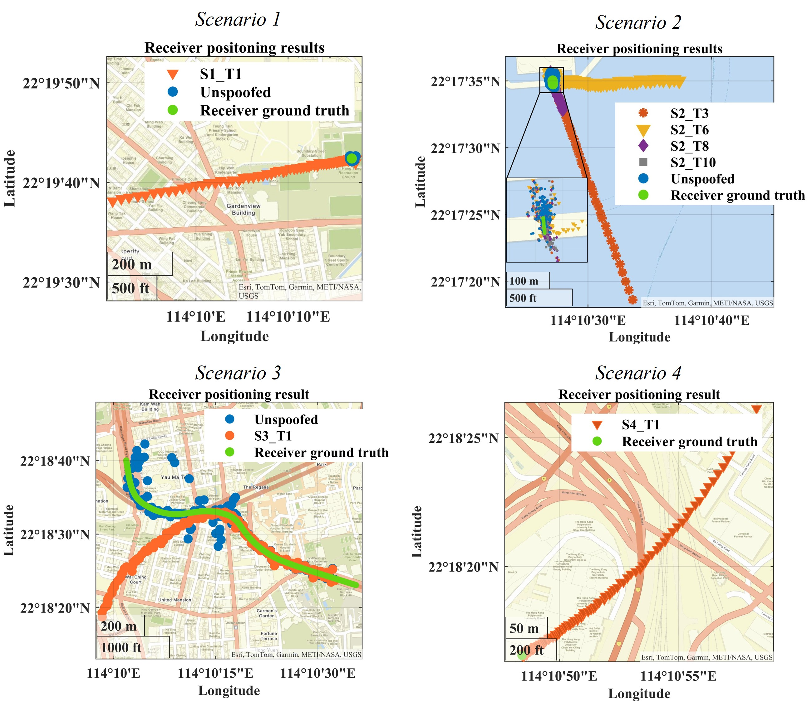
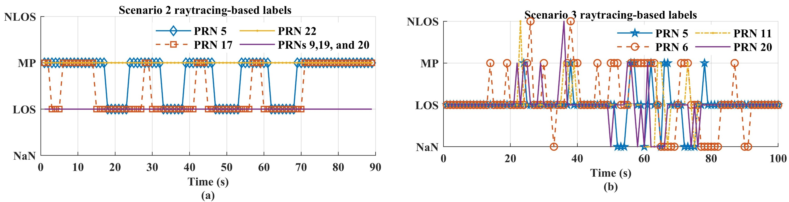

# HK-UrbanSpoof
HK-UrbanSpoof is an open GNSS dataset designed to test whether anti-spoofing
methods remain reliable when spoofing coexists with **real urban multipath,
non-line-of-sight (NLOS) reception, signal blockage, receiver motion, and
tracking instability**. The dataset combines raw GPS L1 intermediate-frequency (IF) recordings with
controlled warm-start synchronous spoofing tests. For the dynamic real-world
scenarios, it also provides GNSS/INS reference trajectories and time-domain
ray-tracing labels for interpreting environmental signal degradation.

<p align="center">
  
</p>


---


## Why HK-UrbanSpoof?
Many anti-spoofing methods are evaluated using clean laboratory recordings or simulated attacks. In real cities, however, multipath and NLOS reception can produce the same receiver-level symptoms often attributed to spoofing, including correlation-function distortion, Doppler oscillation, C/N₀ fluctuation, biased pseudoranges, and unstable tracking outputs.

HK-UrbanSpoof is designed around three practical evaluation gaps:

- **Spoofing and urban propagation coexist.** Authentic signals were recorded in open-sky, coastal suburban, and dense urban environments before controlled spoofing replay in a shielded laboratory.
- **Small attacks can hide inside the urban error floor.** The dataset includes target position offsets as small as 30 m, in addition to 90–750 m attacks.
- **Receiver-level analysis needs interpretable references.** Raw IF data, clean baselines, attack timing, GNSS/INS trajectories, and per-satellitepropagation labels support evaluation from signal tracking to navigation.

## Dataset at a Glance

|Item|Coverage|
|-|-|
|Signal|GPS L1 C/A|
|Public signal data|Raw 8-bit I/Q IF recordings|
|Recordings|4 clean baselines + 17 spoofed tests|
|Environments|Open sky, coastal suburban, dense urban, fully simulated|
|Receiver motion|Static, pedestrian (approximately 0–2 m/s), vehicle|
|Attack model|Warm-start synchronous, code-carrier-consistent, positioning-based attack|
|Attack sequence|Pre-lock → low-power injection → power ramp → smooth pull-off|
|Power advantage|Approximately 1.5–11 dB|
|Target displacement|Approximately 30–750 m|
|Propagation labels|Per-satellite LOS, multipath, NLOS, and blocked/unavailable states at 1 s intervals|

### Four clean baseline scenarios
<p align="center">
  
</p>

<p align="center">
  <em>Figure 1. The test environment, victim receiver trajectory, and sky plot for scenarios 1, 2, 3, and 4. Green satellites indicate line-of-sight (LOS) reception, while orange satellites indicate multipath-affected signals identified by ray-tracing analysis.</em>
</p>

|ID|Environment|Motion|Main purpose|Spoofed tests|
|-|-|-|-|-:|
|**S1**|Real open sky|Static|Stable tracking reference|2|
|**S2**|Real coastal suburban|Pedestrian|Interpretable low-dynamic multipath; includes 30–600 m attacks|11|
|**S3**|Real dense urban canyon|Vehicle|Dynamic blockage, multipath, NLOS, and tracking instability|3|
|**S4**|Fully simulated open sky|Static|Ideal synchronization and environment-free reference|1|

S1–S3 preserve the propagation effects present during outdoor recording. S4
uses simulated authentic and spoofing signals to provide a controlled reference
without environmental interference.


---
## Attack Design
Each test begins with at least 36 s of authentic-signal tracking. The spoofing signal is then injected at negligible power and gradually amplified. During pull-off, its code phase and Doppler evolve smoothly according to a predefined false trajectory.


The main equipment includes:
| Equipment | Role |
|---|---|
| USRP N210 | Transmits authentic and spoofing signal streams during laboratory spoofing tests |
| LabSat 3W | Records spoofed IF signals during laboratory spoofing tests |
| NovAtel SPAN-CPT | Provides GNSS/INS reference solution for selected scenarios |
| GNSS antenna and Ublox F9P | Used for authentic signal collection and victim receiver testing |

<p align="center">
  
</p>

<p align="center">
  <em>Figure 2. Laboratory spoofing transmission testbed: (a) overall experimental flow and (b) implementation inside the shielded anechoic chamber.</em>
</p>

<p align="center">
  
</p>

<p align="center">
  <em>Figure 3. Authentic GNSS signal recording platforms for urban data collection: (a) static and pedestrian scenarios and (b) vehicle scenarios.</em>
</p>


---

## IF Data Configuration

| Center frequency | Intermediate frequency | Sampling rate | Data type | Bandwidth |
|---:|---:|---:|---:|---:|
| 1580 MHz | -4.58 MHz | 58 MHz | 8 bit I/Q | 56 MHz |

## Clean IF Recordings

| File ID | File name | Scenario | File length | Approx. raw IF size |
|---|---|---|---:|---:|
| S1_Clean | `S1_Clean.bin` | 1: Static; open sky | 90 s | 10.44 GB |
| S2_Clean | `S2_Clean.bin` | 2: Low dynamic; sub-urban | 87 s | 10.03 GB |
| S3_Clean | `S3_Clean.bin` | 3: High dynamic; urban | 95 s | 11.10 GB |
| S4_Clean | `S4_Clean.bin` | 4: Static; open sky simulated | 118 s | 13.69 GB |


## Spoofing Test Configuration


|Scenario|File IDs|Injection|Pull-off|Power advantage|Target spoofing distance|File length|
|-|-|-:|-:|-:|-:|-:|
|S1|S1\_T1–S1\_T2|41 s|60 s|4, 11 dB|750 m|90 s|
|S2|S2\_T1–S2\_T3|38 s|50 s|3, 6, 7 dB|600 m|87 s|
|S2|S2\_T4–S2\_T6|38 s|50 s|1.5, 4, 6 dB|300 m|87 s|
|S2|S2\_T7–S2\_T9|38 s|50 s|3.5, 7, 11 dB|90 m|87 s|
|S2|S2\_T10–S2\_T11|38 s|50 s|6, 10 dB|30 m|87 s|
|S3|S3\_T1–S3\_T3|38 s|50 s|3.5, 5, 6 dB|600 m|95 s|
|S4|S4\_T1|41 s|60 s|3 dB|400 m|118 s|

<details>
<summary><strong>Show all 17 spoofing tests</strong></summary>

| File ID | File name | Scenario | Injection time (s) | Pull-off start time (s) | File length (s) | Power advantage (dB) | Target spoofing distance (m) | Approx. raw IF size |
|---|---|---|---:|---:|---:|---:|---:|---:|
| S1_T1 | `S1_T1.bin` | 1: Static; open sky | 41 | 60 | 90 | 4 | 750 | 10.17 GB |
| S1_T2 | `S1_T2.bin` | 1: Static; open sky | 41 | 60 | 90 | 11 | 750 | 10.17 GB |
| S2_T1 | `S2_T1.bin` | 2: Low dynamic; sub-urban | 38 | 50 | 87 | 3 | 600 | 9.95 GB |
| S2_T2 | `S2_T2.bin` | 2: Low dynamic; sub-urban | 38 | 50 | 87 | 6 | 600 | 9.86 GB |
| S2_T3 | `S2_T3.bin` | 2: Low dynamic; sub-urban | 38 | 50 | 87 | 7 | 600 | 9.91 GB |
| S2_T4 | `S2_T4.bin` | 2: Low dynamic; sub-urban | 38 | 50 | 87 | 1.5 | 300 | 9.81 GB |
| S2_T5 | `S2_T5.bin` | 2: Low dynamic; sub-urban | 38 | 50 | 87 | 4 | 300 | 10.23 GB |
| S2_T6 | `S2_T6.bin` | 2: Low dynamic; sub-urban | 38 | 50 | 87 | 6 | 300 | 9.89 GB |
| S2_T7 | `S2_T7.bin` | 2: Low dynamic; sub-urban | 38 | 50 | 87 | 3.5 | 90 | 10.09 GB |
| S2_T8 | `S2_T8.bin` | 2: Low dynamic; sub-urban | 38 | 50 | 87 | 7 | 90 | 9.98 GB |
| S2_T9 | `S2_T9.bin` | 2: Low dynamic; sub-urban | 38 | 50 | 87 | 11 | 90 | 9.91 GB |
| S2_T10 | `S2_T10.bin` | 2: Low dynamic; sub-urban | 38 | 50 | 87 | 6 | 30 | 10.09 GB |
| S2_T11 | `S2_T11.bin` | 2: Low dynamic; sub-urban | 38 | 50 | 87 | 10 | 30 | 9.88 GB |
| S3_T1 | `S3_T1.bin` | 3: High dynamic; urban | 38 | 50 | 95 | 3.5 | 600 | 11.05 GB |
| S3_T2 | `S3_T2.bin` | 3: High dynamic; urban | 38 | 50 | 95 | 5 | 600 | 11.00 GB |
| S3_T3 | `S3_T3.bin` | 3: High dynamic; urban | 38 | 50 | 95 | 6 | 600 | 11.11 GB |
| S4_T1 | `S4_T1.bin` | 4: Static; open sky simulated | 41 | 60 | 118 | 3 | 400 | 13.20 GB |

</details>

### Receiver positioning
<p align="center">
  
</p>

<p align="center">
  <em>Figure 4. Representative receiver positioning results under spoofing attacks.</em>
</p>

### Ray-tracing propagation labels

For every visible satellite and 1 s epoch in S2 and S3:

|Label|Meaning|
|-|-|
|`LOS`|Direct path only|
|`MP`|Direct path plus one or more reflected paths|
|`NLOS`|Direct path blocked; reflected path available|
|`NaN` / blocked|No feasible direct or reflected path identified|

The labels are derived from the receiver reference trajectory, satellite ephemerides, and 3D building models. They are geometric annotations and may not
capture vegetation, moving objects, irregular surfaces, or all dynamic occlusions. The labels were consistent across all tests for scenarios 2 and 3.
<p align="center">
  
</p>

<p align="center">
  <em>Figure 5. Ray-tracing-based per-satellite propagation-state labels for (a) scenario 2 and (b) scenario 3.</em>
</p>

---
## Download
📥 IF data files download link: [Google Drive](https://drive.google.com/drive/folders/1HrKQQEHF89pBKIxq0W7MRZZk1vgLdsj8?usp=sharing)  

📥 GNSS/INS ground truth: Coming soon

📥 Ray-tracing labels: Coming soon

---
## Citation
📖For detailed information about the dataset, please refer to our paper：[2026 ION GNSS+](https://www.ion.org/gnss/abstracts.cfm?paperID=16974)

Currently, the IF data are publicly available, while the receiver ground truth and ray-tracing-based labels will be released upon publication of the paper.
If you use this dataset in your research, please cite:

```bibtex
TBC
```

📩 For questions or data issues, please:

* open a [GitHub issue](https://github.com/Fangjingxiaotao/HK-UrbanSpoof/issues);
* contact: [jingxiaotao2.fang@connect.polyu.hk](mailto:jingxiaotao2.fang@connect.polyu.hk)  .

---

## Acknowledgement

The authors would like to thank Huang Feng, Liu Xikun, Tan Qijun, Zhou Zihong, and Li Zhengdao from the [Intelligent Positioning and Navigation Laboratory](http://qmohsu.github.io/en/) and [Trustworthy AI and Autonomous Systems (TAS) Laboratory](https://polyu-taslab.github.io/) for their valuable assistance with data collection.
